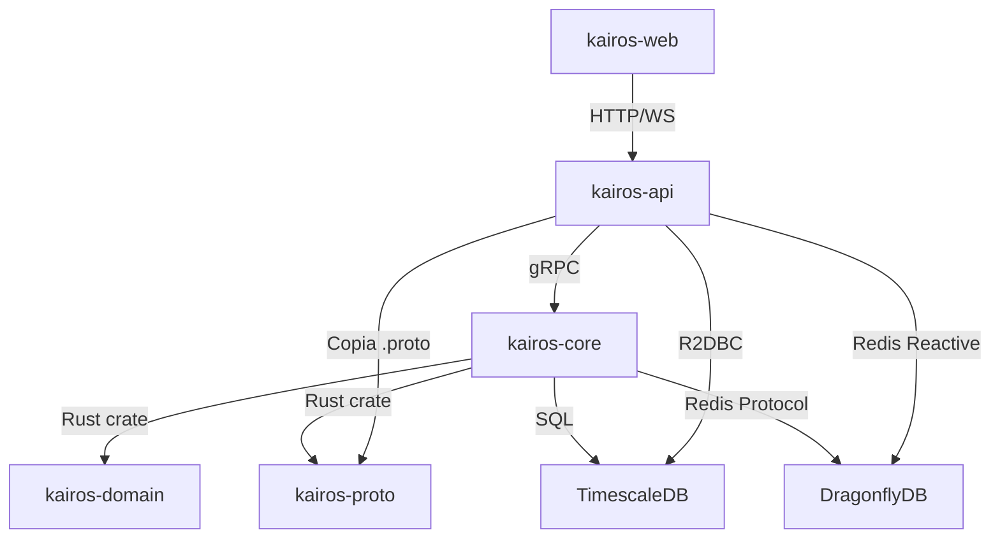

# Project Structure - KAIRÓS Trading System

Este documento describe la organización de carpetas del monorepo KAIRÓS y el propósito de cada módulo a alto nivel.

---

## 📁 Estructura del Repositorio

```
kairos-monorepo/
├── .github/                    # CI/CD workflows (GitHub Actions)
├── .git/                       # Git repository data
├── apps/                       # Aplicaciones ejecutables
│   ├── kairos-core/            # [EL MONOLITO] Motor de Trading (Rust)
│   ├── kairos-api/             # [SATÉLITE] API Gateway (Java Spring Boot)
│   └── kairos-web/             # [SATÉLITE] Dashboard (Angular)
├── libs/                       # Librerías compartidas (Rust Crates)
│   ├── kairos-domain/          # Entidades de dominio (Order, MarketTick, etc.)
│   └── kairos-proto/           # Definiciones gRPC (.proto + código generado)
├── infrastructure/             # [EL HIERRO] Infraestructura y deployment
│   ├── docker/                 # Dockerfiles para cada componente
│   ├── db/                     # Scripts SQL y configuración de bases de datos
│   ├── k8s/                    # Manifiestos de Kubernetes (futuro)
│   ├── scripts/                # Scripts de deployment y utilidades
│   └── docker-compose.yml      # Orquestación local de servicios
├── docs/                       # Documentación del proyecto
│   ├── ADR/                    # Architecture Decision Records
│   └── ENVIRONMENT_SETUP.md    # Guía de configuración de entorno
├── notebooks/                  # Jupyter notebooks para research (Python)
├── research/                   # Scripts de investigación y backtesting
├── scripts/                    # Scripts de utilidad del monorepo
├── target/                     # Artefactos de compilación de Rust (gitignored)
├── .env.example                # Template de variables de entorno
├── .gitignore                  # Archivos ignorados por Git
├── Cargo.lock                  # Lockfile de dependencias Rust
├── Cargo.toml                  # Configuración del Rust Workspace
├── CHANGELOG.md                # Historial de cambios del proyecto
├── CONTRIBUTING.md             # Guía de contribución
├── DEPLOYMENT.md               # Guía de despliegue
├── GLOSSARY.md                 # Glosario de términos
├── LICENSE                     # Licencia del proyecto (MIT)
├── PROJECT_STRUCTURE.md        # Este archivo
├── README.md                   # Visión general del proyecto
└── TECH_STACK.md               # Stack tecnológico completo
```

---

## 🦀 apps/kairos-core (El Monolito - Rust)

**Propósito:** Motor de trading de ultra-baja latencia que procesa datos de mercado, ejecuta estrategias, valida riesgos y ejecuta órdenes.

### Estructura Interna

```
apps/kairos-core/
├── src/
│   ├── main.rs                 # Entry point - Inicializa Tokio runtime
│   ├── domain/                 # 🧠 Lógica de Negocio Pura (Sin deps externas)
│   │   ├── strategies/         # Estrategias de trading (Bellman-Ford, etc.)
│   │   ├── risk/               # Motor de Riesgo (validaciones, límites)
│   │   └── entities.rs         # Entidades internas del dominio
│   ├── application/            # Casos de Uso y Orquestación
│   │   ├── state.rs            # Gestión de estado global (Saldo Atómico)
│   │   └── engine.rs           # Coordinador de componentes
│   └── adapters/               # 🔌 Adaptadores Técnicos (Puertos hexagonales)
│       ├── inbound/            # Entrada de datos al sistema
│       │   ├── feed_handler/   # WebSocket clients (Binance, OKX)
│       │   └── grpc_server/    # Servidor gRPC para recibir órdenes
│       └── outbound/           # Salida de datos del sistema
│           ├── persistence/    # SQLx (Timescale), Redis (Dragonfly)
│           └── execution/      # HTTP/WS para ejecutar en exchanges
├── Cargo.toml                  # Configuración del crate
└── tests/                      # Tests de integración
```

### Componentes Clave

| Componente | Ubicación | Función |
|------------|-----------|---------|
| **Feed Handler** | `adapters/inbound/feed_handler/` | Escucha WebSockets de exchanges, normaliza datos |
| **Strategies** | `domain/strategies/` | Algoritmos de trading (arbitraje, ML) |
| **Risk Engine** | `domain/risk/` | Valida órdenes contra límites de riesgo |
| **Execution** | `adapters/outbound/execution/` | Envía órdenes a exchanges |
| **Persistence** | `adapters/outbound/persistence/` | Guarda datos en DB sin bloquear trading |
| **gRPC Server** | `adapters/inbound/grpc_server/` | Recibe comandos de satélites |

### Flujo de Datos

```
Exchange WebSocket → Feed Handler → Broadcast Channel
                                          ↓
                    ┌─────────────────────┼─────────────────────┐
                    ↓                     ↓                     ↓
              Strategies            Persistence            Dashboard
                    ↓
                MPSC Channel
                    ↓
              Risk Engine
                    ↓
              Execution → Exchange API
```

---

## ☕ apps/kairos-api (API Gateway - Java)

**Propósito:** Expone REST API y WebSocket para el dashboard. Intermedia entre kairos-web y kairos-core.

### Estructura Interna

```
apps/kairos-api/
├── src/
│   ├── main/
│   │   ├── java/com/kairos/
│   │   │   ├── KairosApiApplication.java      # Entry point Spring Boot
│   │   │   ├── config/                        # Configuración (Redis, DB, CORS)
│   │   │   ├── model/                         # DTOs y Entities
│   │   │   ├── repository/                    # R2DBC Repositories (Reactive)
│   │   │   ├── service/                       # Lógica de negocio
│   │   │   ├── grpc/                          # Cliente gRPC a kairos-core
│   │   │   ├── controller/                    # REST Controllers
│   │   │   └── websocket/                     # WebSocket Handlers
│   │   ├── resources/
│   │   │   ├── application.yml                # Configuración Spring
│   │   │   └── proto/                         # Copia de .proto files
│   └── test/                                  # Tests unitarios e integración
├── pom.xml                                    # Maven configuration
├── README.md                                  # Documentación específica
├── API_DOCS.md                                # Documentación de endpoints
└── CHANGELOG.md                               # Historial de cambios
```

### Endpoints Principales

| Endpoint | Método | Descripción |
|----------|--------|-------------|
| `/api/market-data/{symbol}` | GET | Obtiene datos de mercado |
| `/api/orders` | POST | Crea orden (vía gRPC a core) |
| `/api/balance/{asset}` | GET | Consulta balance |
| `/ws/market-data` | WebSocket | Stream de precios en tiempo real |

### Stack

- **Spring Boot 3.2** (WebFlux - Reactive)
- **R2DBC** (PostgreSQL reactivo)
- **Redis Reactive** (DragonflyDB)
- **gRPC Client** (a kairos-core)

---

## 🅰️ apps/kairos-web (Dashboard - Angular)

**Propósito:** Interfaz web para visualizar mercados, gestionar estrategias y monitorear el sistema.

### Estructura Interna

```
apps/kairos-web/
├── src/
│   ├── app/
│   │   ├── core/                  # Servicios singleton (API client, Auth)
│   │   ├── features/              # Módulos de características
│   │   │   ├── dashboard/         # Dashboard principal
│   │   │   ├── market-data/       # Gráficos de mercado
│   │   │   ├── orders/            # Gestión de órdenes
│   │   │   └── settings/          # Configuración de estrategias
│   │   └── shared/                # Componentes reutilizables
│   └── assets/                    # Imágenes, estilos globales
├── angular.json                   # Configuración de Angular
├── package.json                   # Dependencias npm
├── tsconfig.json                  # Configuración TypeScript
└── README.md                      # Documentación específica
```

### Comunicación

- **HTTP REST** → kairos-api (para comandos)
- **WebSocket** → kairos-api (para datos en tiempo real)

---

## 📚 libs/ (Librerías Compartidas)

### libs/kairos-domain

**Propósito:** Tipos de datos y entidades de dominio compartidas entre kairos-core y futuros componentes Rust.

```
libs/kairos-domain/
├── src/
│   ├── lib.rs              # Entry point
│   ├── models.rs           # Order, MarketTick, Balance, etc.
│   ├── enums.rs            # OrderType, OrderStatus, Exchange, etc.
│   └── errors.rs           # Errores custom del dominio
└── Cargo.toml              # Dependencias mínimas (serde, chrono, uuid)
```

**Uso:**
```rust
use kairos_domain::models::Order;
use kairos_domain::enums::OrderType;
```

### libs/kairos-proto

**Propósito:** Definiciones de gRPC (Protocol Buffers) y código generado automáticamente.

```
libs/kairos-proto/
├── proto/
│   └── trading_engine.proto    # Definición del servicio
├── src/
│   └── lib.rs                  # Código Rust generado por tonic-build
├── build.rs                    # Script de compilación .proto
└── Cargo.toml                  # Dependencias: tonic, prost
```

**Servicios Definidos:**
- `TradingEngine.PlaceOrder`
- `TradingEngine.GetBalance`
- `TradingEngine.GetSystemStatus`

---

## 🏗️ infrastructure/ (Infraestructura)

### infrastructure/docker/

Dockerfiles para cada componente:

| Archivo | Descripción |
|---------|-------------|
| `Dockerfile.core` | Imagen multi-stage para kairos-core (Rust) |
| `Dockerfile.api` | Imagen para kairos-api (Java Maven) |
| `Dockerfile.web` | Imagen para kairos-web (Angular con nginx) |
| `nginx.conf` | Configuración nginx para servir Angular |

### infrastructure/db/

| Archivo | Descripción |
|---------|-------------|
| `init_timescale.sql` | Esquema inicial de TimescaleDB (tablas OHLCV) |
| `dragonfly.conf` | Configuración de DragonflyDB (tuning latencia) |

### infrastructure/k8s/

Manifiestos de Kubernetes para deployment en producción (futuro).

### infrastructure/docker-compose.yml

Orquesta todos los servicios localmente:
- DragonflyDB (puerto 6379)
- TimescaleDB (puerto 5432)
- kairos-core (puerto 50051)
- kairos-api (puerto 4000)
- kairos-web (puerto 4200)

---

## 📖 docs/ (Documentación)

### docs/ADR/

Architecture Decision Records:
- `README.md` - Índice de ADRs
- `ADR-001-seleccion-rust-motor-trading.md`
- `ADR-003-grpc-comunicacion-interna.md`
- Etc.

### docs/ENVIRONMENT_SETUP.md

Guía detallada para configurar el entorno de desarrollo.

---

## 🔬 research/ y notebooks/

**Propósito:** Experimentación con estrategias, backtesting, análisis de datos.

- **notebooks/:** Jupyter notebooks (Python)
- **research/:** Scripts de Python para ML/AI (futuro)

---

## 🛠️ scripts/

Scripts de utilidad para el monorepo:
- `deploy.sh` - Script de deployment
- `generate-proto.sh` - Regenerar código gRPC (si se necesita)

---

## 📦 Archivos Raíz

| Archivo | Propósito |
|---------|-----------|
| `Cargo.toml` | Configuración del Rust Workspace (define `members`) |
| `Cargo.lock` | Lockfile de dependencias Rust |
| `.env.example` | Template de variables de entorno |
| `README.md` | Visión general del proyecto |
| `DEPLOYMENT.md` | Guía de despliegue |
| `CONTRIBUTING.md` | Guía de contribución |
| `GLOSSARY.md` | Glosario de términos |
| `TECH_STACK.md` | Stack tecnológico |
| `PROJECT_STRUCTURE.md` | Este archivo |
| `LICENSE` | Licencia MIT |

---

## 🔄 Flujo de Compilación

### Desarrollo Local

```bash
# Compilar todo el workspace Rust
cargo build --workspace

# Compilar solo el core
cargo build --bin kairos-core

# Compilar la API Java
cd apps/kairos-api && mvn clean package

# Compilar el frontend
cd apps/kairos-web && npm run build
```

### Docker

```bash
# Compilar todas las imágenes
docker compose -f infrastructure/docker-compose.yml build

# Iniciar todo el sistema
docker compose -f infrastructure/docker-compose.yml up
```

---

## 🎯 Separación de Concerns

### Arquitectura Hexagonal (Rust Core)

```
Domain (Pura lógica de negocio)
    ↕
Application (Casos de uso)
    ↕
Adapters (Implementación técnica)
```

### 3-Tier Architecture (Java API)

```
Controller (REST/WebSocket)
    ↕
Service (Lógica de negocio)
    ↕
Repository (Acceso a datos)
```

### Component Architecture (Angular)

```
Feature Modules
    ↕
Core Services (Singleton)
    ↕
Shared Components (Reusables)
```

---

## 📊 Dependencias Entre Módulos



---

## 🔐 Convenciones de Seguridad

- **Secretos:** NUNCA commitear en Git (usar `.env`)
- **API Keys:** Solo en variables de entorno
- **Passwords:** Solo en `.env` o secrets manager en prod

---

## 📝 Mantenimiento

- Actualizar este documento cuando se añadan/eliminen módulos
- Sincronizar con cambios en `README.md`
- Referenciar en ADRs cuando haya decisiones estructurales

---

**Última actualización:** 2026-01-06  
**Mantenido por:** KAIRÓS Team
